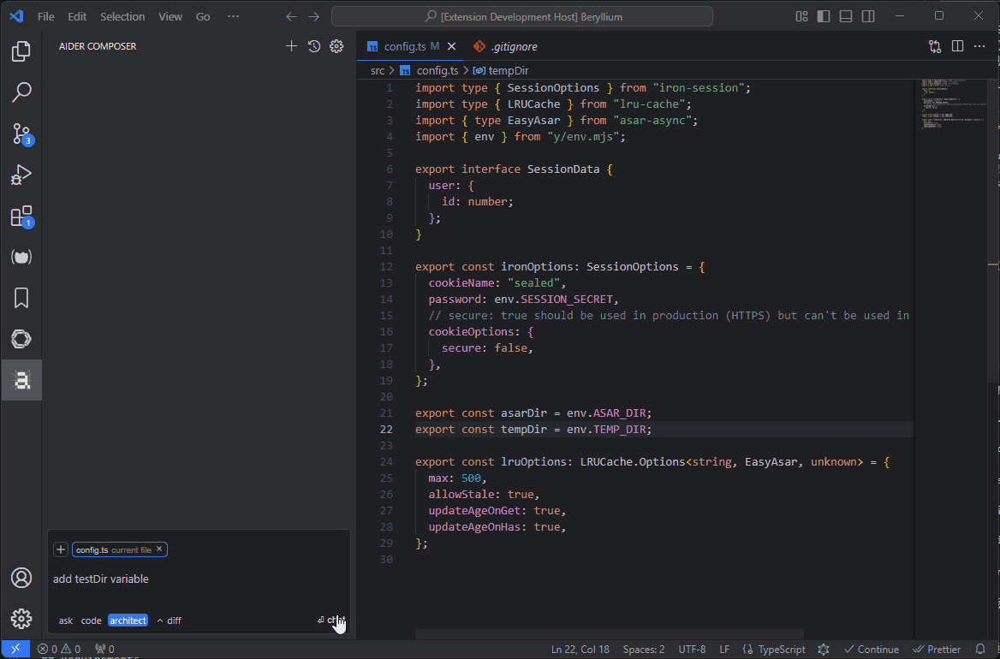
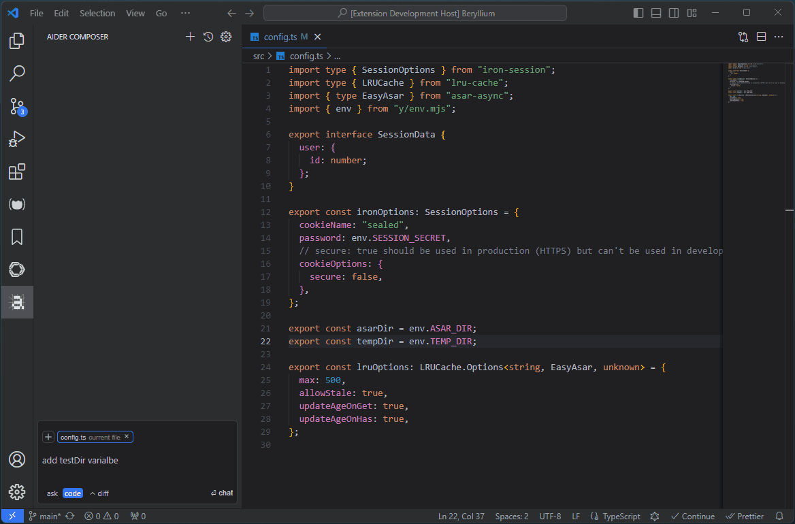
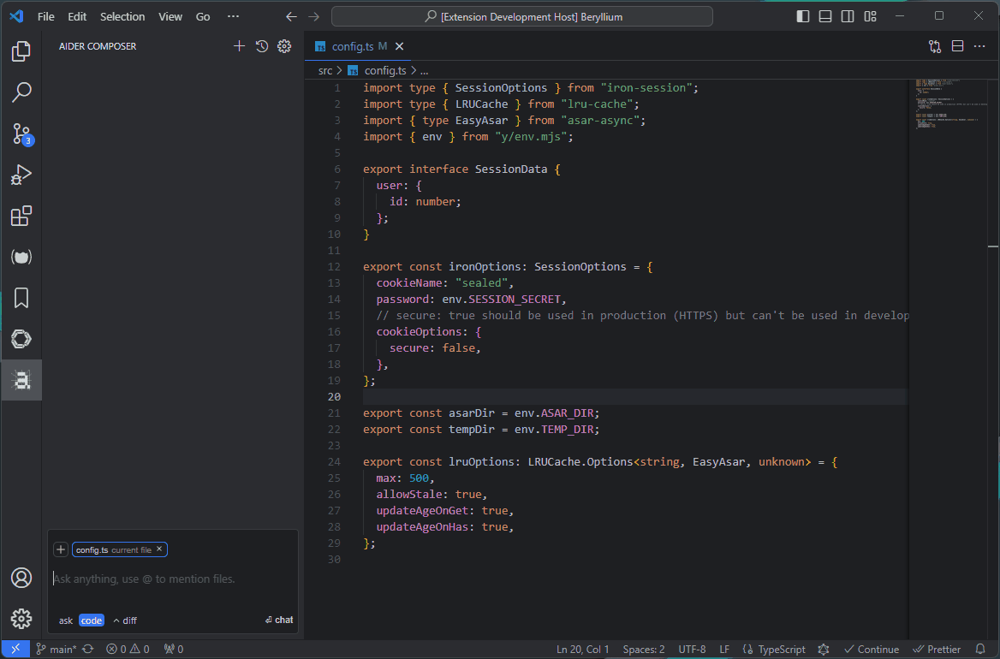
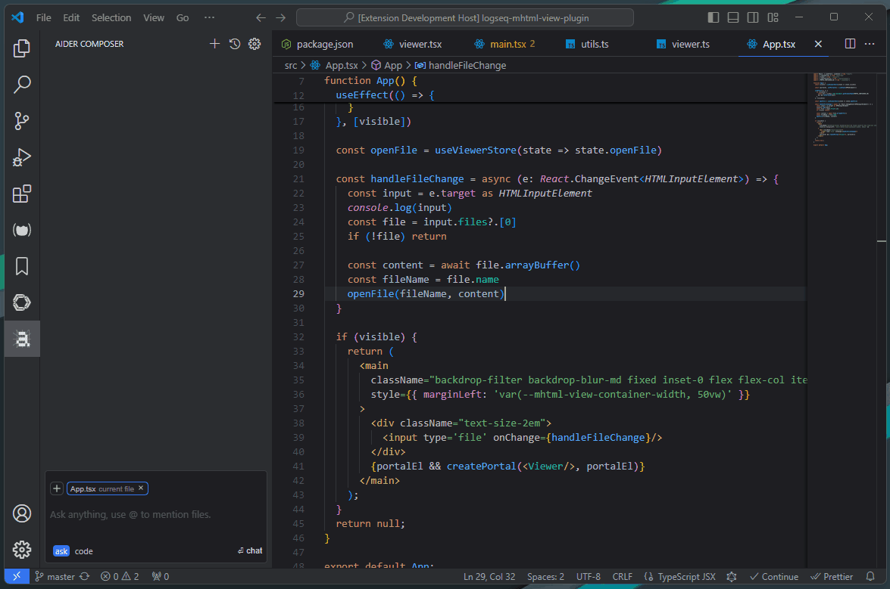
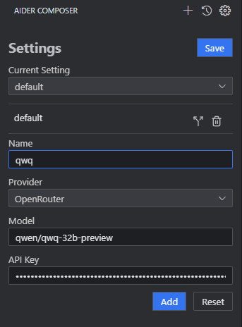

# Aider Composer

Aider Composer is a VSCode extension that integrates [Aider](https://github.com/Aider-AI/aider) into your development workflow. This extension is highly inspired by [cursor](https://www.cursor.com/) and [cline](https://github.com/cline/cline).


It is highly recommended to read the [Requirements](#requirements) and [Extension Settings](#extension-settings) sections for initial configuration, otherwise the extension may not work correctly.

## 🎉🎉News🎉🎉

- Support [VSCode Remote](#vscode-remote)
- [Architect Mode](#architect-mode), Note: the `editor` part will not show in the chat area. so you will see nothing after the `architect` part.
  
- [Multiple Models Support](#multiple-models)
- [Generate Code Mode](#generate-code)
  
- [Add Code Snippet to Chat](#add-code-snippet)
- Add [Inline Diff Preview](#inline-diff-preview)

## Features

- Easily add and remove files, and toggle between read-only and editable modes with just a click
- Most chat modes are supported, including `ask`, `diff`, `diff-fenced`, `udiff`, and `whole`, and you can easily switch between them
- Review code changes before applying them, support both inline diff preview and diff editor preview (default).
- Chat history sessions are supported
- HTTP Proxy is supported (uses VSCode's `http.proxy` setting, authentication not supported)

### Note

Due to certain limitations and other issues, this extension may not implement all features available in Aider. Some limitations include:

- Multiple workspaces are not supported
- Git repository features are not used
- Linting is not supported
- Testing is not supported
- Voice features are not supported
- In-chat commands are not usable
- Configuration options are not supported

## Requirements

This extension uses the Python packages `aider-chat` and `flask` to provide background services. You need to:

- Install Python (download from [python.org](https://www.python.org/) or use other methods). For Mac or Python venv installations, please refer to [this issue](https://github.com/lee88688/aider-composer/issues/2)
- Install the required packages using: `pip install aider-chat flask`

### Install Required Packages With Virtual Environment

It is recommended to install Python from [python.org](https://www.python.org/) in Windows. Other systems may be installed by the system package manager.

When you install Python, it is recommended to create a virtual environment and install the packages in the virtual environment. You can use the following command to create a virtual environment:

#### In Linux Or Mac
```bash
# create virtual environment, .venv is the name of the virtual environment, you can change it to any name you want
python -m venv .venv
# or in some systems, you may need to use python3
python3 -m venv .venv

# activate virtual environment
source .venv/bin/activate
```

#### In Windows

```powershell
# create virtual environment, .venv is the name of the virtual environment, you can change it to any name you want
python -m venv .venv
# activate virtual environment
.venv\Scripts\activate
```

Virtual environment is recommended because it can avoid conflicts with the system Python environment.

### Install Packages

After you **activate** the virtual environment, you need to install `aider-chat` and `flask` packages in the virtual environment. You can use the following command to install the packages:

```bash
pip install aider-chat flask
```

After you install the packages, you can set the `aider-composer.pythonPath` to the directory containing the Python executable in the VSCode settings.

when in Linux or Mac, the path is in the virtual environment directory, like `path/to/.venv/bin`.

when in Windows, the path is in the virtual environment directory, like `path/to/.venv/Scripts`.

### Startup issue

Since this extension needs extra things to run, how do I know the errors why it doesn't work? When the extension startup, it will execute a command to start the background service, you can see the output like below:

> 2025-01-19 13:55:33.344 [info] aider-chat process args: /home/lee/aider/bin/python -m flask -A /home/lee/.vscode-server/extensions/lee2py.aider-composer-1.10.0/server/main.py run --port 13329

The log above is the command used in VSCode SSH Remote. when it fails, you can see some error logs to diagnose the problem. But sometimes the error logs are not enough, you can use this command (`/home/lee/aider/bin/python -m flask -A /home/lee/.vscode-server/extensions/lee2py.aider-composer-1.10.0/server/main.py run --port 13329`) to execute and see the error logs in the terminal.

## Extension Settings

This extension contributes the following setting:

- `aider-composer.pythonPath`: The directory containing the Python executable (not the Python executable path itself) where `aider.chat` and `flask` packages are installed. This setting is required for the extension to activate.

## How To Use

### Chat Mode

Aider supports five chat modes: `ask`, `diff`, `diff-fenced`, `udiff`, and `whole`. In this extension, you can switch between them by clicking the mode name in the chat input area.

The chat modes are divided into three groups: `ask`, `code` and `architect`.

- `ask` mode is for general questions and will not modify any files
- `code` mode includes all other chat modes and is used for code modifications. The optimal chat mode may vary depending on your LLM model and programming language. For more information, refer to [Aider's leaderboards](https://aider.chat/docs/leaderboards/).
- `architect` mode splits the chat into two parts: `architect` and `editor`. The `architect` part is used for describing how to solve the coding problem and will not modify any files. The `editor` part is used for code modifications.

#### Architect Mode

To use `architect` mode, you need to set `Editor Model` in the settings page. And there is a limitation because of `aider-chat`'s implementation. The `editor` will not show in the chat area. So you will see nothing after the `architect` part as shown below.

For more information about `architect` mode, please refer to [Aider's documentation](https://aider.chat/2024/09/26/architect.html).


#### Tips

- If the LLM outputs an incorrect diff format, code modifications may fail. Try switching to a different diff format
- The leaderboard is tested with Python code, so optimal modes may differ for other languages
- The `whole` mode may be the easiest for LLMs to understand but can consume more tokens


### File Reference

In Aider, you can reference files in the chat, file reference can be readonly or editable. a readonly file can't be modified.

In this extension, file reference is above the chat input area, you can click the file name to toggle the reference mode. when reference is **highlighted border**, it means the file is **editable**. there is two ways to add a new file reference:

- click add button and add references, this references is readonly by default.
- use `@` to reference a file in chat input area, this file will be editable by default.


### Code Review

When Aider modifies code, it will show you the code. You have two review options:
- Use diff editor (default)
- Use inline diff preview

#### Diff Editor

when Aider modify code, it will show you a diff editor, you can review the code changes and confirm to apply them by clicking the button `✔` at editor toolbar.


#### Inline Diff Preview

When Aider modifies code, it will show you an inline diff preview. You can review the code changes and accept or reject each snippet by clicking the `accept` or `reject` button before the diff.

To enable this feature, you need to set `aider-composer.inlineDiff.enable` to `true` in VSCode settings and **restart** VSCode.



### Add Code Snippet

You can add a code snippet to the chat by selecting code in the editor and pressing `ctrl+shift+k`.



### Generate Code

You can enter generate code mode by pressing `ctrl+shift+l` in the editor. The current line will be highlighted, and the code generated by Aider will appear below the highlighted line.


### Settings

#### Multiple Models

You can add multiple models and switch between them in the settings page. When you switch model or add new model, you need to **click save button** on top right to take effect.



#### VSCode Remote

This extension supports VSCode Remote, but you need to set `aider-composer.pythonPath` to the Python executable path in the remote server. And the most important thing is you need to install `Python` and the required packages `pip install aider-chat flask` in the <mark>remote server</mark>.

---

**Enjoy!**
